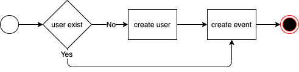

# ToDoList API

## Describe

使用ktor一個代辦事項清單(ToDoList)API Service

## API 需求

1. 新增代辦事項

2. 編輯代辦事項

3. 刪除代辦事項

4. 查看代辦事項內容

5. 查看單一使用者代辦事項清單

6. 查看所有代辦事項清單

## 資料庫設計

### `users` Table Schema

| rom | type | describe | remarks |
| --- | ---- | -------- | ------- |
| id | Int(11)| 使用者ID | pk鍵, auto increment |
| name | varchar(30) | 使用者名稱 |not null |

### `events` Table Schema

| rom | type | describe | remarks |
| --- | ---- | -------- | ------- |
| id | Int(11)| 事件ID | pk, auto increment |
| user_id | Int(11) | 事件建立使用者ID |fk |
| title | varchar(30) | 事件名稱 | not null |
| content | text | 事件內容 | not null |
| create_at | timestamp | 事件建立時間 | not null |
| update_at | timestamp | 事件最後時間 | not null |
| delete_at| timestamp | 事件刪除時間 | allow null |

### 關聯性

users (1) <------> (n) events

## 其他需求

1. 使用`Restful`進行API設計

2. 查看單一使用者代辦事項清單與查看所有代辦事項清單與建立快取

3. 請使用git進行版本控制，並在此repo下新開一個branch進行開行開發

4. 請使用者資料建立時間請參照下面流程圖

